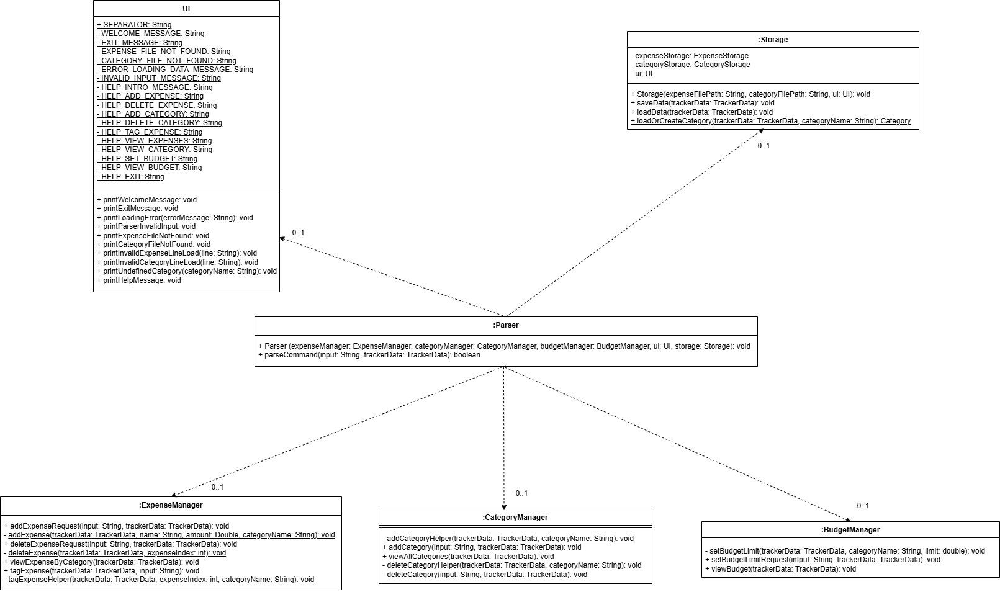
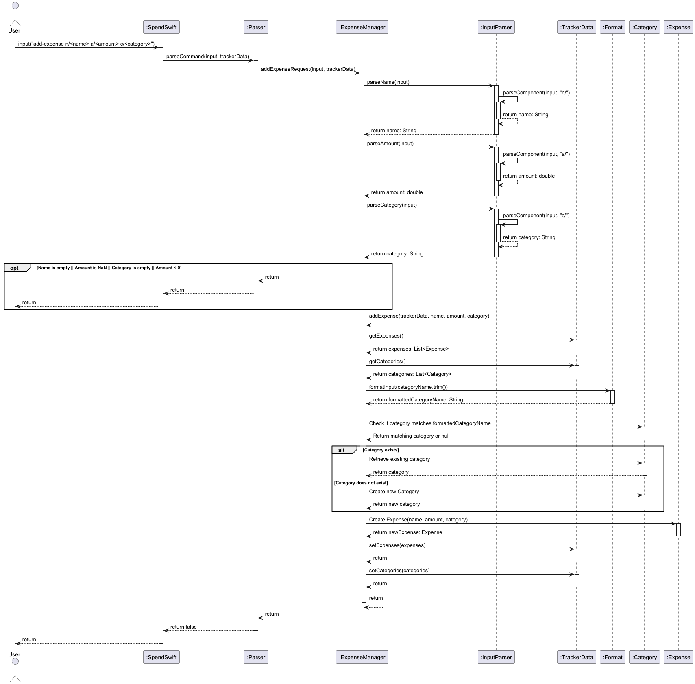
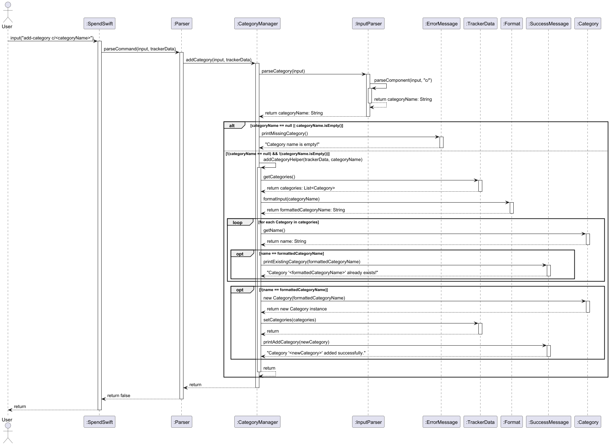
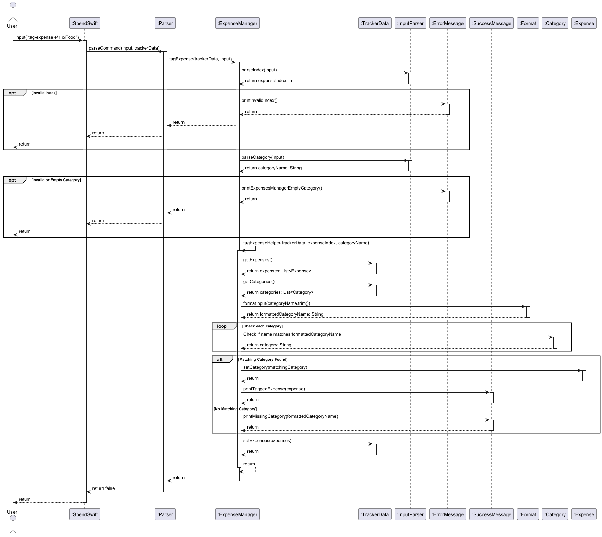
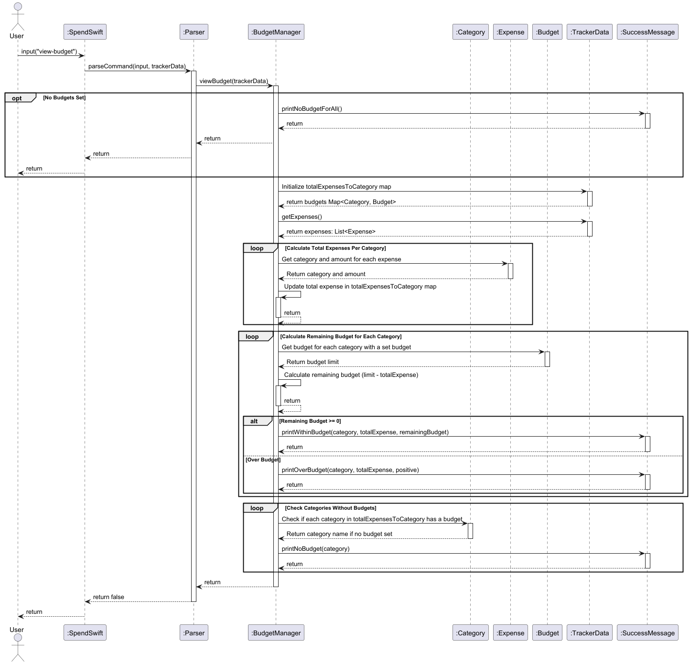

# Developer Guide for SpendSwift

## Design & Implementation
### Architecture
A high-level overview of the system is shown in the Architecture Diagram below.

### Main Components  
SpendSwift class is in charge of launching the program, 
and initialising the components that does the main execution of the program.
- UI: Prints messages
- Parser: Determines the command to execute and checks the logic 
- Command: Determines the feature the user wants to use
- Storage: Writes data to, and reads data from hard disk

### Overall Sequence Diagram
The sequence diagram below describes how the components interacts with one another when the user issues a command.

In this sequence diagram, all the components would be grouped together and simplified for easier understanding. 
- All the commands, which are all the classes in the commands package, would be classified under `:Command` here.
- All storage classes would be classified under `:Storage`

**The sections below give more details of the components and any additional components.**

---

## Class Diagrams
### Storage

`Storage` is designed to handle the saving and loading of data for categories and expenses within the program.
- `Storage`: Coordinates the loading and saving of data for both categories and expenses. 
It creates and manages instances of `ExpenseStorage` and `CategoryStorage`.
- `ExpenseStorage`: Responsible for loading and saving expense data to a file. 
Each expense record contains the expense name, amount, and category.
- `CategoryStorage`: Manages category data, including category names and optional budget limits. 
It loads and saves categories to a file, ensuring the integrity of category data and budget associations.

The `Storage` class employs composition to manage instances of `ExpenseStorage` and `CategoryStorage`. 
This design centralizes all data storage-related operations within Storage, providing a single interface for other 
parts of the system to interact with. By encapsulating these operations, any changes to data-saving or loading 
processes can be isolated within the individual storage classes, minimizing the impact on the rest of the application.

This structure separates expenses and categories into distinct storage classes — `ExpenseStorage` and `CategoryStorage` 
— which clarifies their respective responsibilities. This separation promotes modularity and enhances maintainability 
by ensuring each storage class focuses exclusively on managing one type of data.

### Parser

`Parser` serves as the main component, acting as a command interpreter that directs input to the relevant classes 
(`UI`, `Storage`, `ExpenseManager`, `CategoryManager`, and `BudgetManager`).
- `UI`: Displays messages for various actions.
- `Storage`: Enhances maintainability and allows updates to data handling without distrupting the logic.
- `ExpenseManager`: Provide methods when an expense-related command is issued
- `CategoryManager`: Provide methods when an category-related command is issued
- `BudgetManager`: Provide methods when an budget-related command is issued

By centralising control, `Parser` simplifies input handling, efficiently routing and processing commands through the 
appropriate subsystems. This design fosters modularity and separation of concerns, with each class surrounding `Parser` 
dedicated to a specific role within the system. This enhances control flow and minimise direct dependencies among 
components.

Each class serves a distinct purpose and this clear division of responsibilities promotes modularity, 
making the system more adaptable and maintainable.

### TrackerData

`TrackerData` serves as the main data structure, consolidating and managing `Category`, `Expense`, and `Budget` data 
for efficient tracking and processing within the program.
The manager classes (`ExpenseManager`, `CategoryManager`, and `BudgetManager`) are designed to interact directly with 
`TrackerData` to handle commands related to their respective domains.
- `Category`: Defines and organises each category by name, 
providing a streamlined structure for grouping expenses and budgets.
- `Expense`: Represents individual expenses, with attributes for the name, amount, and category, 
allowing categorisation of expenses and easy budget monitoring.
- `Budget`: Tracks spending limits for specific categories.
- `ExpenseManager`: Handles operations related to expenses. 
It provides methods for adding, deleting, and managing expenses within the system.
- `CategoryManager`: Manages categories, including the addition and deletion of categories. 
It works closely with `TrackerData` to ensure the appropriate category associations for expenses and budgets.
- `BudgetManager`: Handles the management of budgets, including setting and updating budget limits, 
and calculating remaining budget based on associated expenses. It operates in conjunction with `TrackerData` to 
track expenses per category.

Centralising data management in `TrackerData` and delegating specific command handling to the respective manager classes
promotes a clean separation of concerns. `TrackerData` acts as the central hub for data access and manipulation, 
ensuring a unified approach to data handling across the system. This structure simplifies data access and updates, 
while each manager class focuses on a specific domain, enhancing modularity.

This modular design allows for easy extensions and maintenance. 
Each manager is responsible for a distinct aspect of the application — expenses, categories, or budgets — encapsulating 
functionality within modules. As a result, adjustments to categories, expenses, or budgets can be made independently 
without disrupting other parts of the system, supporting a scalable and well-organized financial tracking solution.

---

## Sequence Diagrams
### 1. add-expense
**Overview**

The sequence diagram represents the flow for adding a new expense in SpendSwift when the user inputs an `add-expense` command. 
For simplification, the UI package is not included.

**Implementation**
### 2. delete-expense
**Overview**

The sequence diagram represents the flow for deleting an existing expense in SpendSwift when the user inputs an `delete-expense` command.

**Implementation**
### 3. add-category
**Overview**

The sequence diagram represents the flow for adding a new category in SpendSwift when the user inputs an `add-category` command.

**Implementation**
1. User Input and Parsing:
   - The user inputs the command `add-category c/<categoryName>`. 
   - SpendSwift receives the input and passes it to `Parser`, which then calls `addCategory` method in `CategoryManager`. 
   - `CategoryManager` delegates input parsing to `InputParser` to extract the category name from the command.

2. Validation of Category Name:
   - After parsing, `CategoryManager` checks if the `categoryName` is null or empty. If it is, an error message is displayed using `ErrorMessage`. 

3. Formatting and Duplicate Check:
   - If the `categoryName` is valid, `CategoryManager` retrieves the list of categories from `TrackerData` and formats the `categoryName` using `Format`.
   - It then iterates through the categories list, checking if a category with the same formatted name already exists. If a match is found, `SuccessMessage` is used to display a message stating that the category already exists.

4. Adding a New Category:
   - If no match is found, a new `Category` object is created with the formatted name.
   - This new category is added to the categories list, which is then saved back to `TrackerData`.
   - A success message is displayed indicating that the category was added successfully.

### 4. delete-category
### 5. tag-expense
**Overview**

The sequence diagram represents the flow for tagging an expense to an existing category in SpendSwift when the user inputs an `tag-expense` command.

**Implementation**
### 6. set-budget
### 7. view-expenses
**Overview**

The sequence diagram represents the flow for printing all the expenses by categories in SpendSwift when the user inputs an `view-expenses` command.

**Implementation**
### 8. view-category
**Overview**

The sequence diagram represents the flow for printing all the categories in SpendSwift when the user inputs an `view-category` command.

**Implementation**
### 9. view-budget
**Overview**

The sequence diagram represents the flow for printing all the budgets in SpendSwift when the user inputs an `view-budget` command.

**Implementation**
### 10. help
**Overview**

The sequence diagram represents the flow for printing all the help messages in SpendSwift when the user inputs an `help` command.

**Implementation**

---

## Product Scope
<!-- @@author glenda-1506 -->
### Target User Profile
SpendSwift is designed for budget-conscious individuals who prefer a simple, efficient way to track expenses and manage budgets using text commands.

### Value Proposition
SpendSwift provides a fast, text-based solution for managing finances, eliminating the complexity of traditional budgeting tools.

---

## User Stories
<!-- @@author glenda-1506 -->  

| Version | As a...               | I want to...                                 | So that I can...                                         |
|---------|-----------------------|----------------------------------------------|----------------------------------------------------------|
| v1.0    | Budget-conscious user | Quickly log an expense using a typed command | track my spending with easy input                        |
| v1.0    | Budget-conscious user | View my budget for all categories            | see how much I could spend                               |
| v1.0    | Budget planner        | View all my expenses                         | monitor what I have been spending on                     |
| v1.0    | Frequent user         | Set a budget limit for each category         | limit my spending according to categories                |
| v1.0    | Frequent user         | Delete an expense entry                      | quickly correct mistakes                                 |
| v1.0    | Frequent user         | Categorize expenses                          | customize my expense tracking to better manage my budget |
| v2.0    | New user              | See commands easily                          | quickly familiarise myself with the program              |
| v2.0    | Frequent user         | Save my previous inputs                      | record over a period of time                             |
| v2.1    | Frequent user         | Delete a category entry                      | remove what is not in use                                |
| v2.1    | Frequent user         | View all categories                          | see what categories I have been spending on              |

---

## Non-Functional Requirements
<!-- @@author mayfairmi6 -->  

| ID  | Requirement         | Description                                                                                | Rationale                                                                                   |
|-----|---------------------|--------------------------------------------------------------------------------------------|---------------------------------------------------------------------------------------------|
| 1   | Responsiveness      | The system should respond to user commands within 2 seconds.                               | Ensures efficient interaction and enhances user satisfaction.                               |
| 2   | Data Integrity      | The system must maintain accurate tracking and updating of financial entries.              | Prevents discrepancies in financial reporting, ensuring reliability.                        |
| 3   | User Error Handling | The system should provide clear error messages and support easy correction of user inputs. | Facilitates management of entries and reduces user frustration.                             |
| 4   | Customizability     | Users should be able to easily add and modify expense categories.                          | Allows users to tailor the system to their specific needs.                                  |
| 5   | Automated Tasks     | Support automated budget resets at the start of each month.                                | Minimizes user effort in maintaining accurate monthly tracking.                             |
| 6   | Accessibility       | The chat interface should be simple and intuitive.                                         | Ensures that all users can effectively interact with the system without extensive training. |

---

## Instructions for Manual Testing
### 1. Start SpendSwift
Follow the Quick Start instructions in the [User Guide](UserGuide.md).

Expected Outcome: Load data, if data file present, and welcome message on the terminal.

### 2. Test Cases
#### 2.1 Introduction to SpendSwift

Test Case: `help`

Expected Outcome: Prints a summarized list of possible commands in SpendSwift.

#### 2.2 Adding Expenses
- ##### 2.2.1 Add a Valid Expense
    
    Prerequisites: None
    
    Test Case: `add-expense n/Coffee a/5.50 c/Food`
    
    Expected Outcome: "Coffee" expense of $5.50 is added under "Food" category.

- ##### 2.2.2 Add an Expense Without Category (Defaults to 'Uncategorized')
    
    Prerequisites: None
    
    Test Case: `add-expense n/Book a/15`
    
    Expected Outcome: "Book" expense of $15 is added under "Uncategorized".

#### 2.3 Deleting Expenses
- ##### 2.3.1 Delete an Existing Expense by Index

    Prerequisites: At least one expense added.
    
    Test Case: `delete-expense e/1`
    
    Expected Outcome: The expense at index 1 is removed.

- ##### 2.3.2 Attempt to Delete a Non-Existing Index

    Prerequisites: None
    
    Test Case: `delete-expense e/100`
    
    Expected Outcome: Error message indicating an invalid index.

#### 2.4 Adding and Managing Categories
- ##### 2.4.1 Add a New Category

    Prerequisites: None
    
    Test Case: `add-category Transportation`
    
    Expected Outcome: "Transportation" category is created and available for tagging.

- ##### 2.4.2 Tag an Expense to an Existing Category
    
    Prerequisites: At least one expense and category added.
    
    Test Case: `tag-expense e/1 c/Transportation`
    
    Expected Outcome: Expense at index 1 is tagged to "Transportation".

- ##### 2.4.3 Tag an Expense to a Non-Existing Category
    
    Prerequisites: At least one expense added.
    
    Test Case: `tag-expense e/1 c/Luxury`
    
    Expected Outcome: Error message indicating category "Luxury" does not exist.

#### 2.5 Setting and Viewing Budget Limits
- ##### 2.5.1 Set Budget Limit for a Category
    
    Prerequisites: Category "Food" added.
    
    Test Case: `set-budget c/Food l/100.00`
    
    Expected Outcome: Budget of $100.00 is set for "Food", viewable in view-budget.

- ##### 2.5.2 Set Budget for a Non-Existing Category
    
    Prerequisites: None
    
    Test Case: `set-budget c/Luxury l/100.00`
    
    Expected Outcome: Error message indicating the category does not exist.

#### 2.6 Viewing Expenses and Budgets
- ##### 2.6.1 View All Expenses
    
    Prerequisites: None
    
    Test Case: `view-expenses`
    
    Expected Outcome: Displays a list of all recorded expenses, categorized.

- ##### 2.6.2 View Budget Summary for Each Category
    
    Prerequisites: Budget set for at least one category.
    
    Test Case: `view-budget`
    
    Expected Outcome: Displays summary of spending and remaining budget for categories with budget limits.

#### 2.7 Toggle Automatic Budget Reset
Prerequisites: None

Test Case: `toggle-reset`

Expected Outcome: Toggles the automatic monthly budget reset between "on" and "off".

### 3. End SpendSwift
Prerequisite: None

Test Case: `bye`

Expected Outcome: Application exits and data is saved in spendswift.txt.
